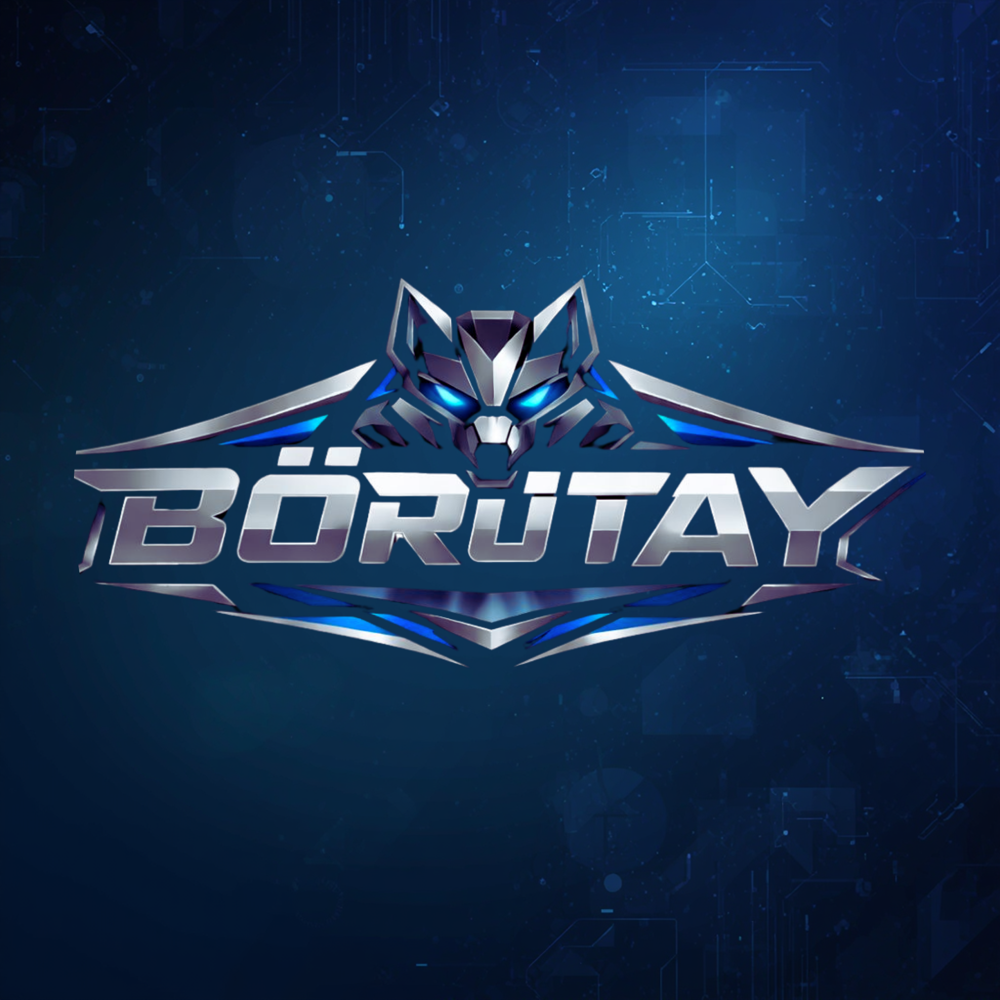
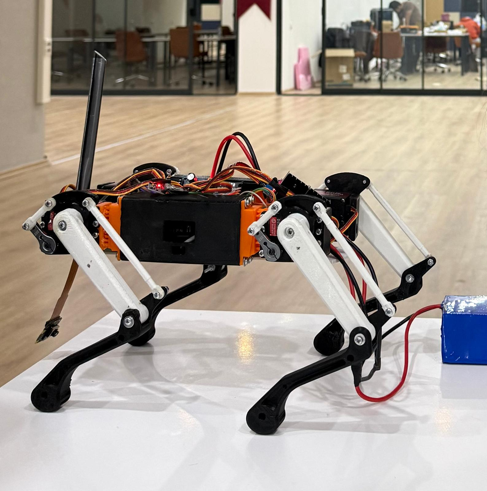
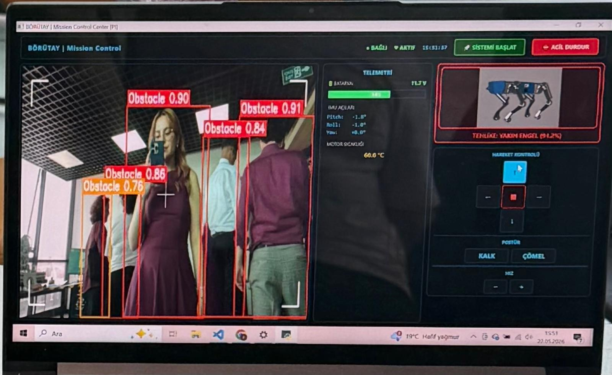
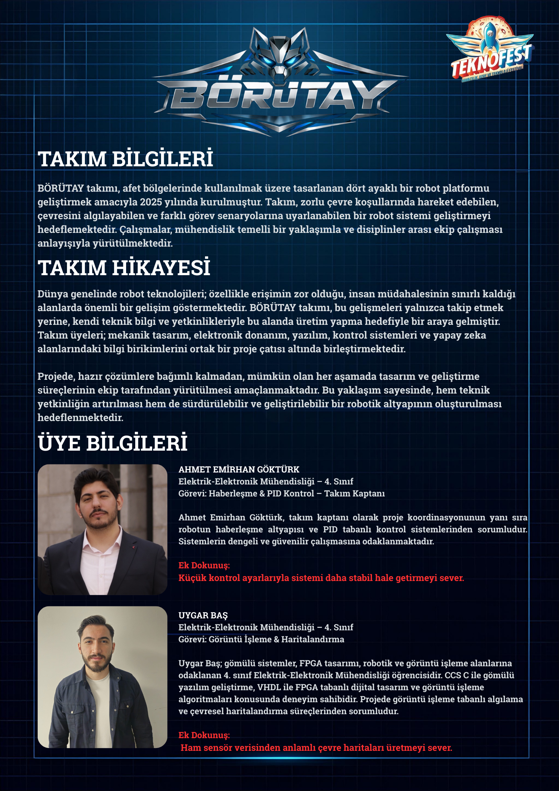
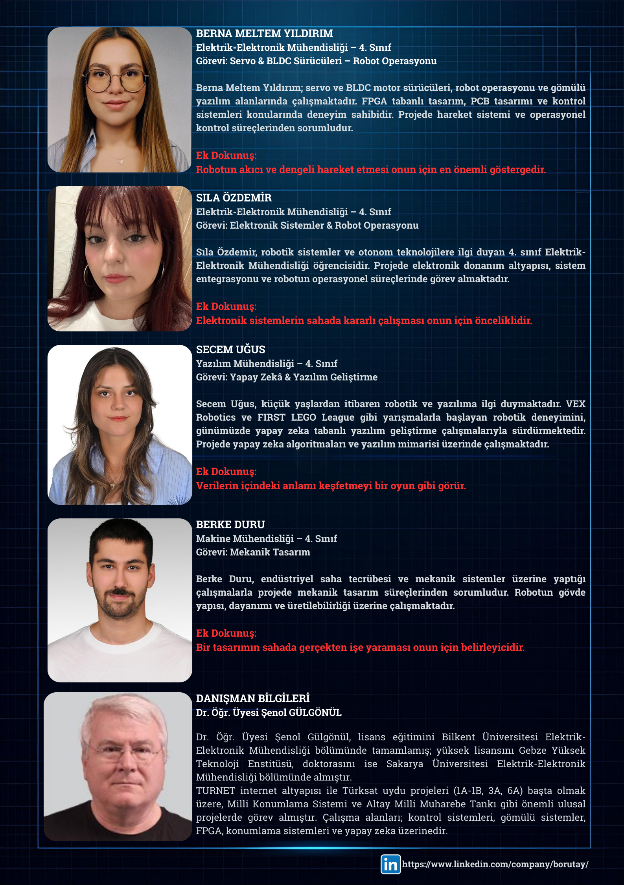

<p align="center">
  
</p>

<h1 align="center">
BÖRÜTAY
</h1>

<p align="center">
Hybrid Quadruped Robot Platform for Disaster Response and Autonomous Robotics
</p>

<p align="center">


</p>

---

# Overview

**BÖRÜTAY** is a modular hybrid quadruped robotic platform developed by the **BÖRÜTAY Team** at **OSTİM Technical University**.

The project has been developed as a research and development platform capable of operating in disaster response scenarios while serving as a flexible testbed for robotics, embedded systems, autonomous navigation and intelligent control algorithms.

The current version features a **2-DOF quadruped architecture** powered by **Raspberry Pi 5**, providing stable walking, real-time monitoring and wireless remote operation.

The next generation of BÖRÜTAY is currently under development and will include:

- 3-DOF Leg Architecture
- Wheel-Leg Hybrid Mobility
- Robotic Arm
- Deneyap Controller Integration
- RFID Module
- OLED Display
- micro-ROS Distributed Architecture
- AI Assisted Navigation

---

## Robot Platform

<p align="center">

</p>

---

# Project Objectives

BÖRÜTAY has been designed with the following engineering objectives:

- Develop a modular quadruped robotic platform.
- Support disaster response operations.
- Provide reliable wireless teleoperation.
- Implement embedded Linux based robotic control.
- Integrate computer vision capabilities.
- Develop scalable embedded hardware architecture.
- Prepare the platform for future autonomous navigation.
- Establish a flexible software architecture for future robotic extensions.

---

# Current Features

- ✅ 2-DOF Quadruped Walking
- ✅ Raspberry Pi 5 Main Controller
- ✅ MQTT Communication
- ✅ Live Camera Streaming
- ✅ PyQt6 Ground Control Station
- ✅ Inverse Kinematics
- ✅ Servo Calibration
- ✅ Stable Trot Gait
- ✅ Real-Time Robot Monitoring
- ✅ Modular Software Architecture

---

# Future Features

- 🚧 3-DOF Leg Upgrade
- 🚧 Wheel Assisted Locomotion
- 🚧 Robotic Arm
- 🚧 RFID System
- 🚧 OLED Status Display
- 🚧 Deneyap Controller
- 🚧 micro-ROS
- 🚧 Autonomous Navigation
- 🚧 Object Detection
- 🚧 SLAM
- 🚧 AI Based Decision Making

---

# Hardware

The BÖRÜTAY platform has been designed with a modular hardware architecture that allows new sensors and actuators to be integrated without major software modifications.

## Main Computing Unit

- Raspberry Pi 5
- Raspberry Pi OS (64-bit)
- Python 3

## Embedded Controller (Planned)

- Deneyap Kart
- micro-ROS Node
- Peripheral Management

## Servo Control

- PCA9685 16-Channel PWM Driver
- DS3218 High Torque Digital Servo Motors

## Wireless Communication

- Dual MikroTik RouterBOARD Metal 52ac
- Wi-Fi Communication
- MQTT Protocol

## Vision System

- Raspberry Pi Camera Module

Future Vision Features:

- YOLO Object Detection
- Human Detection
- Obstacle Detection
- Autonomous Tracking

## Sensors

Current

- Pi Camera

Future

- IMU
- RFID Reader
- OLED Display

## Future Mobility

- Wheel Modules
- Robotic Arm
- DC Gear Motors

---

# Software Stack

The software architecture is fully modular, allowing each subsystem to be developed independently.

| Layer | Technology |
|--------|------------|
| Operating System | Raspberry Pi OS |
| Programming Language | Python |
| GUI | PyQt6 |
| Communication | MQTT |
| Broker | Mosquitto |
| Computer Vision | OpenCV |
| Motion Control | Inverse Kinematics |
| Servo Driver | PCA9685 |
| Future Middleware | micro-ROS |

---

# Repository Structure

```text
BORUTAY
│
├── CAD
│   ├── SolidWorks
│   ├── STL
│   ├── Assembly
│   └── Render
│
├── Documents
│   ├── Graduation_Project
│   ├── TEKNOFEST
│   └── Images
│
├── GUI
│
├── quadruped_pi
│   ├── main.py
│   ├── config.py
│   ├── quadruped.py
│   ├── gait.py
│   ├── leg.py
│   ├── hardware.py
│   ├── robot_listener.py
│   ├── camera_stream.py
│   ├── fake_gyro.py
│   └── utils.py
│
├── README.md
├── LICENSE
└── .gitignore
```

---

# Software Architecture

```
          Ground Control Station
                 (PyQt6 GUI)
                      │
                      │ MQTT
                      ▼
              Raspberry Pi 5
         ┌──────────┼──────────┐
         │          │          │
     Camera      Motion      Hardware
     Module      Control      Driver
         │          │          │
     OpenCV     IK Solver   PCA9685
         │          │          │
         └──────────┼──────────┘
                    │
              Servo Motors
```

---

# Future Embedded Architecture

```
           Ground Control Station
                    │
                 MQTT Broker
                    │
             Raspberry Pi 5
                    │
              micro-ROS Bridge
                    │
             Deneyap Controller
          ┌────────┼─────────┐
          │        │         │
      DC Motors  RFID      OLED
          │
     Robotic Arm
```

---

# Mechanical Design

Current Platform

- 2 Degrees of Freedom per Leg
- 8 Servo Motors
- Aluminum Mechanical Structure
- Modular Body Design

Future Platform

- 3 Degrees of Freedom per Leg
- 12 Servo Motors
- Wheel-Leg Hybrid Mobility
- Integrated Robotic Arm
- Improved Payload Capacity

---

# Communication

Current Communication

- MQTT
- Wi-Fi
- Raspberry Pi Camera Streaming

Future Communication

- micro-ROS
- ROS2 Topics
- Distributed Embedded Nodes
- Autonomous Robot Services

---

# Motion Control

BÖRÜTAY employs a modular locomotion system based on inverse kinematics and gait generation algorithms.

The current locomotion controller has been designed to provide smooth and stable walking while maintaining a lightweight software architecture that can easily be extended for future robotic capabilities.

## Current Motion Features

- Forward / Backward Walking
- Left / Right Turning
- Stand Mode
- Idle (Crouch) Mode
- Servo Calibration
- Smooth Motion Profiles
- Trot Gait
- Adjustable Step Height
- Adjustable Step Length
- Adjustable Gait Period

## Future Motion Features

- 3-DOF Leg Kinematics
- Dynamic Walking
- Terrain Adaptation
- Hybrid Wheel-Leg Motion
- Self Balancing
- Autonomous Locomotion

---

# Inverse Kinematics

Each leg is independently controlled using inverse kinematics.

Current implementation computes:

- Hip Joint Angle
- Knee Joint Angle

Future implementation:

- Hip Roll
- Hip Pitch
- Knee
- Full 3-DOF Kinematics
- Body Pose Compensation

---

# Computer Vision

The Raspberry Pi Camera provides real-time image streaming to the Ground Control Station.

Current capabilities include:

- Live Video Streaming
- Low Latency Monitoring
- Remote Camera View

Future capabilities include:

- Object Detection (YOLO)
- Human Detection
- Obstacle Detection
- QR / AprilTag Recognition
- Autonomous Target Tracking
- Visual Navigation

---

# Ground Control Station

A custom-developed Ground Control Station allows the operator to remotely monitor and control the robot.

Main Features

- Live Camera Stream
- MQTT Communication
- Motion Commands
- Robot Status
- Speed Adjustment
- Stand / Idle Control
- IMU Monitoring (Simulation)
- Object Detection Window
- System Start Function

---

# Ground Control Station Interface

<p align="center">

</p>

The graphical user interface was developed using **PyQt6** and communicates with the Raspberry Pi over the MQTT protocol.

---

# Project Gallery

## Team

<p align="center">

</p>

<p align="center">

</p>

---

## Exhibition

The BÖRÜTAY project was presented during the **OSTİM Technical University Graduation Projects Exhibition**, demonstrating the successful integration of mechanical design, embedded systems, wireless communication and quadruped locomotion into a single robotic platform.

The exhibition provided an opportunity to showcase the current capabilities of the platform while collecting valuable feedback for future development.

---

# Installation

Clone the repository:

```bash
git clone https://github.com/bernamltmyildrm-prog/BORUTAY.git
```

Navigate to the project directory:

```bash
cd BORUTAY
```

Install the required Python packages:

```bash
pip install -r requirements.txt
```

---

# Running the Project

## Raspberry Pi

Start the MQTT listener:

```bash
python3 robot_listener.py
```

Start the camera stream:

```bash
python3 camera_stream.py
```

---

## Ground Control Station

Launch the GUI:

```bash
python main.py
```

Once the **System Start** button is pressed, the GUI establishes communication with the Raspberry Pi, activates the robot control interface and starts receiving telemetry and live camera data.

---

# Project Workflow

```
Power ON
    │
    ▼
Connect Raspberry Pi
    │
    ▼
Start robot_listener.py
    │
    ▼
Start camera_stream.py
    │
    ▼
Launch Ground Control Station
    │
    ▼
Press "System Start"
    │
    ▼
MQTT Communication Established
    │
    ▼
Robot Ready
```

---

# Development Roadmap

## Phase 1 — Completed

- [x] Mechanical Design
- [x] Electronic Design
- [x] Raspberry Pi Integration
- [x] Servo Control
- [x] Inverse Kinematics
- [x] Trot Gait
- [x] Camera Streaming
- [x] MQTT Communication
- [x] Ground Control Station
- [x] Graduation Project Prototype

---

## Phase 2 — In Progress

- [ ] 3-DOF Leg Upgrade
- [ ] New Mechanical Design
- [ ] Improved Stability
- [ ] Wheel Integration
- [ ] Robot Arm
- [ ] Deneyap Controller
- [ ] RFID Module
- [ ] OLED Display
- [ ] micro-ROS Integration

---

## Phase 3 — Future Development

- [ ] Autonomous Navigation
- [ ] SLAM
- [ ] Visual Navigation
- [ ] Object Detection
- [ ] AI Decision System
- [ ] Autonomous Mission Planning
- [ ] Multi-Robot Communication

---

# Team

| Team Member | Responsibility |
|-------------|----------------|
| **Berna Meltem Yıldırım** | Embedded Systems • Raspberry Pi • MQTT Communication • Servo Control • System Integration |
| **Ahmet Emirhan Göktürk** | Motion Control • Control Algorithms • PID |
| **Uygar Baş** | FPGA • Embedded Systems • Low-Level Software |
| **Sıla Özdemir** | Electronics Design • PCB • Power Electronics |
| **Seçem Uğuş** | Software Engineering • GUI Development |

---

# Academic Advisor

**Dr. Şenol Gülgönül**

Department of Electrical and Electronics Engineering

OSTİM Technical University

---

# Acknowledgements

The BÖRÜTAY Team would like to express sincere gratitude to:

- **OSTİM Technical University**
- **Department of Electrical and Electronics Engineering**
- **Dr. Şenol Gülgönül** for his continuous guidance and academic support throughout the project.
- **OSTİMTech Technology Transfer Office (TTO)** for their valuable support during the development process.

Their encouragement and contributions have played an important role in bringing this project to its current stage.

---

# Contributing

Contributions, suggestions and feedback are always welcome.

If you would like to improve BÖRÜTAY, feel free to open an issue or submit a pull request.

---

# Support the Project

If you find this project interesting or useful, consider giving it a ⭐ on GitHub.

Your support motivates our team and encourages future development.

---

# License

This project is licensed under the **MIT License**.

See the **LICENSE** file for more information.

---

<p align="center">

## BÖRÜTAY

### *Inspired by our heritage. Engineered for the future.*

**Quadruped Robotics • Embedded Systems • Autonomous Technologies**

</p>

<p align="center">

Made with ❤️ by the **BÖRÜTAY Team**

</p>

